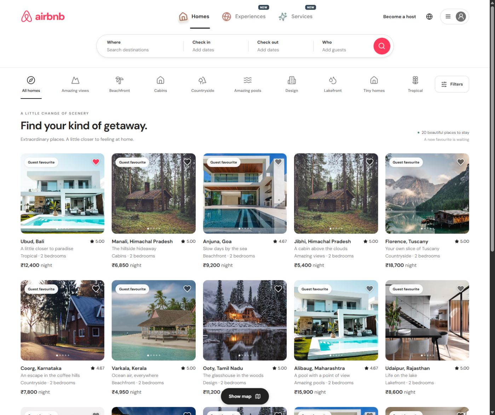
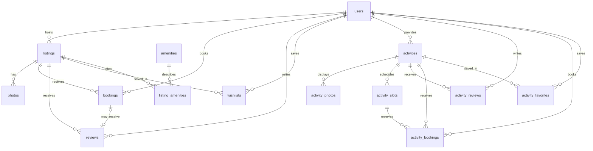

# Airbnb Marketplace

**Live demo:** https://airbnb-fullstack-marketplace.vercel.app

**Public source:** https://github.com/gursimarsingh1001/airbnb-fullstack-marketplace



An original full-stack Airbnb-inspired assignment implementation, built with **Next.js 16 + TypeScript**, **FastAPI**, and **SQLite**. This is an independent educational project, not an official Airbnb product. All homes, hosts, reviews, and payments are fictional; photography is illustrative.

## Features

- Photo-first, responsive explore grid with category navigation, location/date/guest search, price/property/amenity filters, and pagination.
- Detailed home views with photo galleries, amenities, host profiles, reviews, and a two-month availability calendar. Guests can review a confirmed stay after checkout.
- Server-priced checkout, persisted reservations, atomic overlap protection, booking confirmation, Trips, and cancellation.
- Per-profile persisted wishlists. Search/filter state, selected stay dates/guests and unfinished host forms survive refresh in browser local storage. Submitted bookings and listings persist in SQLite. Cancelling a host form discards its local draft.
- A large homepage search bar contracts into a sticky compact bar on scroll. Demo hosts and reviewers have illustrative portraits with initials as a fallback.
- Host dashboard, reservations, and listing creation, editing, and deletion. Photos can be supplied through HTTPS URLs or uploaded as JPEG, PNG, or WebP to the connected private Vercel Blob store (3 MB per image).
- Four selectable demo profiles, including three hosts with independently owned homes.
- Toasts, loading and empty states, keyboard-accessible dialogs, mobile navigation, persistent dark mode, and an interactive map with price pins and home previews.
- Seed data: 48 curated homes plus the original completed-stay demo home, 24 Experiences and 20 Services. Each of the 92 curated offers has a distinct host and cover image; the preserved review-demo home keeps its own host. The seed also includes varied reviews and amenities, four sample home bookings, and a saved home.
- Experiences and Services are database-backed sections with 24 and 20 distinct offerings. They have varied hosts, fixed photo galleries, ratings/reviews, future time slots, search and filters, favorites, mock checkout, and provider CRUD.
- Trips has Upcoming, Past, and Cancelled tabs for all three reservation types. Providers manage their own experiences/services and see the same reservations guests see.
- Home filters also include bedrooms, beds, bathrooms, minimum/maximum rating, and Superhost status.

## Quick start

Requires **Node.js 24+** and **Python 3.10+**. Run commands from the repository root unless otherwise noted.

### 1. Backend

```bash
python -m venv .venv
# Windows PowerShell:
.venv\Scripts\Activate.ps1
# macOS / Linux:
# source .venv/bin/activate
pip install -r backend/requirements.txt
python -m uvicorn backend.main:app --reload --port 8001
```

SQLite tables and sample data are created automatically on first start. The versioned curated-catalogue migration adds 48 distinctive homes and archives the old template-generated demo clones with a soft-delete flag; their booking and review rows remain attached. User-created listings are preserved, and repeated startup does not add duplicate demo records. The original home with the completed review walkthrough remains available unless it was already removed. The default file is `backend/airbnb.db`.

Migration 4 adds Experiences/Services tables and constraints. A later idempotent content migration archives the old repeated demo offerings and seeds 24 Experiences plus 20 Services with stable availability slots for the next 60 days. Existing activity reservations and their snapshots remain in the database. To run initialization explicitly: `python -c "from backend.database import initialize; initialize()"`. Do not delete the database to apply upgrades.

### 2. Frontend (another terminal)

```bash
cd frontend
npm ci
npm run dev
```

Open **http://localhost:3001**. API documentation: **http://127.0.0.1:8001/docs**.

### Production build without Docker

```bash
cd frontend
npm ci
npm run build
cd ..
python -m uvicorn backend.main:app --host 0.0.0.0 --port 8001
```

Open **http://localhost:8001**. Restart the backend after the first frontend build so it mounts `frontend/out/`. FastAPI serves the static Next.js export and the API on the same origin.

### Docker

```bash
docker compose up --build -d
```

Open **http://localhost:8000**. The named `airbnb-data` volume preserves SQLite through container replacement. Do not remove the volume if you want to keep bookings.

## Deployment

The hosted demo uses **Vercel Hobby (free)** for the static Next.js frontend and Python FastAPI function, with a **private Vercel Blob store** holding the SQLite database. No paid plan, trial, or recurring payment is used. Free quotas are finite: service can pause when limits are reached instead of billing overages.

`vercel.json` builds `frontend/` and exposes `api/index.py`. Connect a private Blob store to the project with a server-only `BLOB_READ_WRITE_TOKEN`, and set `DATABASE_BLOB_ENABLED=1` in production. Then run `vercel deploy --prod`.

### How SQLite persists on free serverless hosting

Each API request reads the latest private database snapshot directly from storage, opens a separate temporary SQLite file, and runs the existing SQL queries and transactions. Mutations commit locally, then publish the complete snapshot using an **ETag conditional write**. If another request published first, the stale write fails with HTTP 409 and the user retries against fresh data. Successful responses are returned only after durable upload succeeds. Reads do not upload snapshots. Credentials and database files are never exposed to the frontend.

This design preserves real SQLite, durable data, and safe concurrent writes for a small assignment dataset. It trades additional network latency and whole-file transfers for zero-cost hosting. It is not intended for a high-traffic marketplace: the file is capped at 10 MB, and free Blob operation limits apply. Use a conventional persistent volume or a managed database when scaling beyond a demo.

The included Docker configuration remains available for local or self-hosted use with a named persistent volume. **No paid Render deployment is configured.**

### Configuration

| Variable | Location | Default / purpose |
| --- | --- | --- |
| `DATABASE_BLOB_ENABLED` | Backend | `1` on Vercel; otherwise use a local SQLite file |
| `BLOB_READ_WRITE_TOKEN` | Backend only | Private Blob credential injected by the storage connection |
| `DATABASE_PATH` | Backend | `backend/airbnb.db`; production `/data/airbnb.db` |
| `CORS_ORIGINS` | Backend | `http://localhost:3001,http://127.0.0.1:3001`; comma-separated allowed origins |
| `PORT` | Docker | `8000`; hosting platform may override |
| `NEXT_PUBLIC_API_URL` | Frontend build | Local API in development; same-origin API on hosted URLs |

## Architecture

```text
frontend/
  app/                  Next.js entry pages, metadata and responsive styles
  components/
    Marketplace.tsx     Page composition, navigation and shared state
    layout/             Header, logo and destination inspiration
    search/             Home/activity search bars and home filter dialog
    listings/           Cards, home details, gallery and checkout
    bookings/           Calendar, guest picker and Trips page
    host/               Host dashboard and listing CRUD forms
    maps/               Interactive stay map
    shared/             Dialogs, images, avatars, loading and empty states
    activities/         Experience/Service browse, details, trips and provider UI
    UI.tsx              Compatibility exports for existing imports
  lib/api.ts            HTTP client and money/date helpers
  lib/types.ts          Home, user, review, booking and quote contracts
  lib/search.ts         Search types, defaults and display helpers
  lib/activities.ts     Activity API contracts and categories
  tests/                Frontend domain regression tests
backend/
  main.py               App lifecycle, middleware, errors and router registration
  routers/              HTTP endpoints grouped by resource
  schemas/              Pydantic home/activity request validation
  services/             Availability, serialization and listing/activity operations
  booking_rules.py      Home pricing, date policy and historical price helpers
  dependencies.py       Database connection and demo identity dependencies
  database.py           SQLite connection, schema and initialization
  migrations.py         Versioned schema upgrades
  blob_database.py      Durable snapshots and optimistic concurrency
  seed.py               Original demo dataset and first-run users
  curated_seed.py       Versioned curated homes, hosts and activity data
  activity_schema.py    Activity constraints, indexes and triggers
  activity_seed.py      Activity reviews and rolling availability
  activities.py         Compatibility export for the activity router
  tests/                API, business rules, concurrency and route-contract tests
```

The Next.js App Router builds a static frontend shell. Client-side hash routes (`#explore`, `#listing/4`, `#trips`, `#wishlists`, `#host`) preserve browser back/forward and shareable home URLs. Experiences and Services use `/experiences`, `/services`, and `/{kind}/{id}` paths; Next development rewrites and production fallback routes support direct navigation/refresh. The browser talks directly to the Python API; **all business data resides in SQLite**. Local storage keeps the demo profile, theme and home/activity searches; activity filter drafts use session storage. Bookings and favorites are never stored only in the browser.

See [Code organization](docs/code-organization.md) for the structural refactor, design decisions and verification results.

## Database schema

For a plain-language explanation of the code and the main workflows, see [How the application works](docs/how-it-works.md). The final code-quality review and assignment matrix are in [the compliance report](docs/final-code-quality.md).



| Table | Important fields and constraints |
| --- | --- |
| `users` | ID, name, role (`guest`/`host`), avatar initials or illustrative portrait URL, joined year |
| `listings` | Owner FK, title, description, location, country, category, property type, integer nightly price, cleaning fee, capacity, room counts, coordinates, seeded-demo and soft-delete flags |
| `photos` | Listing FK, URL, position; unique `(listing_id, position)` |
| `amenities` | Unique amenity name |
| `listing_amenities` | Composite primary key `(listing_id, amenity_id)` |
| `bookings` | Listing/user FKs, ISO dates, guests, **price snapshot**, fees, total, status; check-out after check-in |
| `reviews` | Listing/user FKs, optional unique completed-booking FK for guest reviews, rating constrained to 1–5, comment, date |
| `wishlists` | Composite primary key `(user_id, listing_id)` |
| `activities` | Discriminator `kind` (experiences/services), provider FK, content/category/location, duration, capacity, integer INR price, person/group pricing, language, setting, soft deletion |
| `activity_photos` | Offering FK, HTTPS URL, unique offering/position |
| `activity_slots` | Offering FK, ISO day, start time, capacity, active flag; unique offering/day/time |
| `activity_bookings` | Offering/slot/guest/provider FKs, date/time interval, people, immutable quoted price snapshot, status, unique guest/idempotency key |
| `activity_reviews` | Offering/user FKs, rating 1–5, comment; demo reviews aggregated on read |
| `activity_favorites` | Composite primary key `(user_id, activity_id)` prevents duplicates |

Foreign keys are enabled on every connection. Indexes cover listing ownership, user bookings, and availability lookups. Local WAL mode and a 15-second busy timeout support concurrent readers and serialized writes. The cloud snapshot adapter uses DELETE journal mode so the uploaded file contains the entire committed state; ETag checks serialize publication across instances.

### Booking invariants

1. Dates must be today or later in Asia/Kolkata (India), within two years, and between 1 and 90 nights. The browser, API and SQLite triggers use the same India calendar day, including around midnight. Stay dates remain ISO date-only strings.
2. Guests must fit the listing capacity; a host cannot book their own home.
3. A confirmed booking conflicts when `existing.check_in < requested.check_out AND existing.check_out > requested.check_in`. Back-to-back stays are allowed.
4. `BEGIN IMMEDIATE` acquires the SQLite write lock **before** availability is checked. The check and insert commit together. Two simultaneous requests cannot reserve the same nights.
5. Nightly price, cleaning fee, rounded 14% service fee, and total are computed server-side and snapshotted into the booking. Money is stored as whole integer INR; no floating-point money calculations.
6. Cancellation changes the status and immediately releases availability. Hosts cannot delete homes with ongoing or upcoming confirmed stays. Soft deletion preserves historical booking records.

## API overview

Interactive OpenAPI reference is available at `/docs` and schema at `/openapi.json`.

| Method | Endpoint | Purpose |
| --- | --- | --- |
| GET | `/api/health` | API and database health |
| GET | `/api/users` | Selectable demo profiles |
| GET | `/api/listings` | Search and pagination |
| GET | `/api/listings/{id}` | Details, reviews, blocked date ranges |
| POST | `/api/quote` | Validated availability and price breakdown |
| POST | `/api/bookings` | Confirm an atomic mock reservation |
| GET | `/api/bookings` | Current profile's trips |
| DELETE | `/api/bookings/{id}` | Cancel an owned future booking |
| POST | `/api/bookings/{id}/review` | Review an owned, completed confirmed stay once; updates listing rating aggregation |
| GET | `/api/wishlists` | Current profile's saved homes |
| PUT / DELETE | `/api/wishlists/{id}` | Save / remove a home |
| GET | `/api/host/dashboard` | Owned homes and their reservations |
| POST | `/api/host/listings` | Create a home |
| PUT / DELETE | `/api/host/listings/{id}` | Update / soft-delete an owned home |
| POST | `/api/host/photos` | Upload a validated image to the connected private Blob store (host profile required) |
| GET | `/api/photos/{key}` | Serve an uploaded image through the API without exposing the Blob token |

Search parameters: `q`, `category`, `property_type`, `min_price`, `max_price`, `guests`, `amenities` (comma separated), `check_in`, `check_out`, `bedrooms`, `beds`, `bathrooms`, `min_rating`, `max_rating`, `superhost`, `page`, `limit`, `sort` (`recommended`, `price_low`, `price_high`, `rating`).

### Experiences and Services API

| Method | Endpoint | Purpose |
| --- | --- | --- |
| GET | `/api/activities?kind=experiences` | Search/pagination; use `kind=services` for services |
| GET | `/api/activities/{id}` | Content, gallery, aggregated reviews and remaining seats for every future slot |
| POST | `/api/activities/quote` | Current server price and availability for `{slot_id, people}` |
| POST | `/api/activities/bookings` | Atomic confirmation; `{slot_id, people, expected_total}` plus `Idempotency-Key` |
| GET | `/api/activities/bookings` | Current user's experience and service reservations |
| DELETE | `/api/activities/bookings/{id}` | Cancel an owned, not-yet-started reservation |
| GET | `/api/activities/favorites` | Current user's saved offerings |
| PUT / DELETE | `/api/activities/favorites/{id}` | Save/remove without duplicates |
| GET | `/api/activities/host/dashboard` | Provider-owned offerings and reservations |
| POST | `/api/activities/host` | Publish offering, photos and availability atomically |
| PUT / DELETE | `/api/activities/host/{id}` | Owner-only edit or soft removal |

Activity filters: `q`, `category`, `day`, `people`, `min_price`, `max_price`, `min_rating`, `duration` (maximum minutes), `language`, `setting`, `service_location`, `time_of_day`, `sort`, `page`, `limit`. All filters combine before pagination. A date/time search checks remaining capacity and provider conflicts.

Example quote: `POST /api/activities/quote` with `{"slot_id":1,"people":2}` (choose a current slot from the detail response). For a ₹1,800/person experience the server returns `unit_price:1800`, `subtotal:3600`, `service_fee:360`, `total:3960`, and the scheduled day/start/end. Confirm using the same selection, `expected_total:3960`, `X-Demo-User:1`, and a fresh `Idempotency-Key` such as `demo-booking-001`. Retry the identical request/key after a network interruption; change the key for a new reservation.

Experiences share seats within the same session. Services reserve the provider exclusively for the interval, even when priced per person. The same provider cannot run a different offering at an overlapping time. Intervals are start-inclusive/end-exclusive, so adjacent appointments work. All demo appointments use **IST**, including international offerings, and must start in the future. Availability is published at most two years ahead; sessions cannot cross midnight. A `BEGIN IMMEDIATE` transaction plus SQLite triggers enforces capacity/provider-time checks. Quotes use integer INR and a rounded 10% fee. Historical prices never change after a provider edits the offering. Soft removal is blocked until upcoming/ongoing reservations finish or are cancelled.

Provider request examples and an interview walkthrough are in [the three-section implementation report](docs/marketplace-expansion.md).

Quote request (`POST /api/quote`):

```json
{"listing_id":21,"check_in":"2027-01-10","check_out":"2027-01-13","guests":2}
```

The response contains `nights`, `nightly_price`, `subtotal`, `cleaning_fee`, `service_fee`, `total`, and `currency`. Checkout sends that server-quoted total back as `expected_total`, and includes a unique `Idempotency-Key` header:

```http
POST /api/bookings
X-Demo-User: 1
Idempotency-Key: 2bf61684-...
Content-Type: application/json
```

```json
{"listing_id":21,"check_in":"2027-01-10","check_out":"2027-01-13","guests":2,"expected_total":54586}
```

The API recomputes the price and checks that it still matches before inserting the reservation. A retry with the same key and identical request returns the same confirmation; using that key for changed checkout details returns `409`. The create response includes the reservation ID/status and the persisted price breakdown. An overlapping stay or changed quote also returns `409`; malformed or out-of-policy dates return `422`; an unknown listing returns `404`.

### Booking walkthrough

The browser asks `POST /api/quote` for a selected listing, date range, and guest count. The FastAPI endpoint reads the current listing and confirmed reservations from SQLite, applies the Asia/Kolkata date-only policy, and returns the exact integer-INR price breakdown. Checkout then posts those selections, the quoted total, the selected demo user, and an idempotency key. A SQLite `BEGIN IMMEDIATE` transaction locks writers before checking the half-open reservation interval and inserting the price snapshot. SQLite constraints/triggers repeat the critical checks. Only after commit does the API return the confirmed server total; My Trips and the host dashboard read the same persisted row. On the hosted free demo the snapshot adapter reads/publishes that SQLite file in private Blob storage and detects stale writers with an ETag check.

Demo identity uses the `X-Demo-User` header (default `1`). Profiles: Alex/guest `1`, Ananya/host `2`, Marco/host `3`, Made/host `4`. Role and ownership checks are enforced server-side, but **identity selection is intentionally public and is not production authentication**. Do not enter private data in this demo.

## Verification

```bash
python -m pytest backend/tests -q
cd frontend
npm ci
npm run lint
npm run typecheck
npm test
npm run build
```

The isolated backend regression suite and frontend domain/API tests cover search and pagination, exact server quotes, SQLite persistence and migrations, all overlap shapes, adjacent stays, concurrent double booking, idempotent retries, invalid input, host ownership, CRUD, cancellation, per-user wishlists, and cloud snapshot durability/stale-writer rejection. GitHub Actions runs backend tests, frontend lint/typecheck/unit tests, and the production build on pushes and pull requests. The current audit's measured results are recorded in [docs/audit.md](docs/audit.md); screenshots are in [docs/screenshots/](docs/screenshots/).

Manual browser checks include date selection, checkout, persisted trips, host forms, filters, empty states, and mobile/desktop layouts. See the [current audit evidence](docs/audit.md) and the [earlier verification record](docs/VERIFICATION.md) (the latter records a previous release).

## Assumptions and limits

- Real payments, messaging, and identity verification are mocked. Homes, Experiences, and Services have real SQLite-backed workflows, but all inventory and reservations are fictional.
- Experience/service reviews are seeded and read-only; guest review submission is implemented for completed home stays. Activity photos accept HTTPS URLs; cloud upload remains available in the home editor. International activity times deliberately use IST, not each destination's local timezone.
- No card details are collected. Cancellation is a full mock refund before check-in.
- Seed photos use public Unsplash URLs and require network access. Host uploads accept JPEG, PNG, and WebP files up to 3 MB and use the existing private Vercel Blob store; the API serves uploaded files through a same-origin proxy without exposing storage credentials. Local upload needs `BLOB_READ_WRITE_TOKEN` in the backend process; HTTPS URL entry remains available without it. Vercel Hobby Blob quotas are shared with the database snapshot, so this demo deliberately keeps uploads small. Tests use a mocked Blob HTTP client; a real 233,700-byte JPEG upload and byte-for-byte retrieval also passed against the deployed API on 9 October 2026. Free quota still applies.
- Maps use Leaflet and OpenStreetMap tiles, with approximate seeded town coordinates. Explore shows all matching results across pagination, groups nearby price pins, supports country selection, and opens a photo preview before navigating to a home. Detail pages show the surrounding area. Host-created homes without coordinates show their location text instead of an invented pin. Tile loading needs internet access; the listing list remains usable if it fails. No API key, account, paid plan, or user geolocation is needed. Visible attribution is retained and tiles use normal browser caching; see the [OSM tile policy](https://operations.osmfoundation.org/policies/tiles/).
- Seed reviews contribute to live per-listing average ratings, and the Superhost flag is seeded and shown on home cards/details. A demo completed trip is available in Trips; each completed confirmed stay may be reviewed once by the booking guest.
- Dark mode is a persistent browser preference in the account menu. The responsive layout is designed for phone, tablet, and desktop widths.
- Responsive layout supports mobile, tablet, and desktop. Dates are property-style calendar dates rather than timezone-adjusted timestamps.
- The visual implementation is written from scratch, inspired by Airbnb's layout patterns. No Airbnb source code or existing clone repository was copied.
