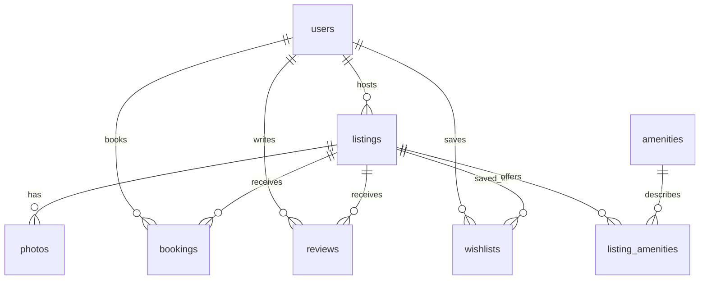

# Airbnb Marketplace

**Live demo:** https://airbnb-fullstack-marketplace.vercel.app

**Public source:** https://github.com/gursimarsingh1001/airbnb-fullstack-marketplace


An original full-stack Airbnb-inspired assignment implementation, built with **Next.js 16 + TypeScript**, **FastAPI**, and **SQLite**. This is an independent educational project, not an official Airbnb product. All homes, hosts, reviews, and payments are fictional; photography is illustrative.

## Features

- Photo-first, responsive explore grid with category navigation, location/date/guest search, price/property/amenity filters, and pagination.
- Detailed home views with five-photo galleries, amenities, host profiles, reviews, and a two-month availability calendar.
- Server-priced checkout, persisted reservations, atomic overlap protection, booking confirmation, Trips, and cancellation.
- Per-profile persisted wishlists.
- Host dashboard, reservations, and listing creation, editing, and deletion. Photos are supplied through URLs.
- Four selectable demo profiles, including three hosts with independently owned homes.
- Toasts, loading and empty states, keyboard-accessible dialogs, mobile navigation, and an illustrative clickable map.
- Seed data: 20 homes, six users, 60 reviews, four upcoming bookings, and a saved home.

## Quick start

Requires **Node.js 22.9+** (24 recommended) and **Python 3.10+**. Run commands from the repository root unless otherwise noted.

### 1. Backend

```bash
python -m venv .venv
# Windows PowerShell:
.venv\Scripts\Activate.ps1
# macOS / Linux:
# source .venv/bin/activate
pip install -r backend/requirements.txt
python -m uvicorn backend.main:app --reload --port 8001
```

SQLite tables and sample data are created automatically on first start. Existing databases are never reseeded or cleared. The default file is `backend/airbnb.db`.

### 2. Frontend (another terminal)

```bash
cd frontend
npm ci
npm run dev
```

Open **http://localhost:3001**. API documentation: **http://127.0.0.1:8001/docs**.

### Production build without Docker

```bash
cd frontend
npm ci
npm run build
cd ..
python -m uvicorn backend.main:app --host 0.0.0.0 --port 8001
```

Open **http://localhost:8001**. Restart the backend after the first frontend build so it mounts `frontend/out/`. FastAPI serves the static Next.js export and the API on the same origin.

### Docker

```bash
docker compose up --build -d
```

Open **http://localhost:8000**. The named `airbnb-data` volume preserves SQLite through container replacement. Do not remove the volume if you want to keep bookings.

## Deployment

The hosted demo uses **Vercel Hobby (free)** for the static Next.js frontend and Python FastAPI function, with a **private Vercel Blob store** holding the SQLite database. No paid plan, trial, or recurring payment is used. Free quotas are finite: service can pause when limits are reached instead of billing overages.

`vercel.json` builds `frontend/` and exposes `api/index.py`. Connect a private Blob store to the project with a server-only `BLOB_READ_WRITE_TOKEN`, and set `DATABASE_BLOB_ENABLED=1` in production. Then run `vercel deploy --prod`.

### How SQLite persists on free serverless hosting

Each API request reads the latest private database snapshot directly from storage, opens a separate temporary SQLite file, and runs the existing SQL queries and transactions. Mutations commit locally, then publish the complete snapshot using an **ETag conditional write**. If another request published first, the stale write fails with HTTP 409 and the user retries against fresh data. Successful responses are returned only after durable upload succeeds. Reads do not upload snapshots. Credentials and database files are never exposed to the frontend.

This design preserves real SQLite, durable data, and safe concurrent writes for a small assignment dataset. It trades additional network latency and whole-file transfers for zero-cost hosting. It is not intended for a high-traffic marketplace: the file is capped at 10 MB, and free Blob operation limits apply. Use a conventional persistent volume or a managed database when scaling beyond a demo.

The included Docker configuration remains available for local or self-hosted use with a named persistent volume. **No paid Render deployment is configured.**

### Configuration

| Variable | Location | Default / purpose |
| --- | --- | --- |
| `DATABASE_BLOB_ENABLED` | Backend | `1` on Vercel; otherwise use a local SQLite file |
| `BLOB_READ_WRITE_TOKEN` | Backend only | Private Blob credential injected by the storage connection |
| `DATABASE_PATH` | Backend | `backend/airbnb.db`; production `/data/airbnb.db` |
| `CORS_ORIGINS` | Backend | `http://localhost:3001,http://127.0.0.1:3001`; comma-separated allowed origins |
| `PORT` | Docker | `8000`; hosting platform may override |
| `NEXT_PUBLIC_API_URL` | Frontend build | Local API in development; same-origin API on hosted URLs |

## Architecture

```text
frontend/
  app/                  Next.js entry point, metadata, global responsive styles
  components/
    Marketplace.tsx     Navigation, explore/search, wishlist, trips, shared state
    Detail.tsx          Gallery, availability, quote, checkout, confirmation
    Host.tsx            Host dashboard and listing CRUD forms
    UI.tsx              Cards, modal/focus trap, calendar, guest picker
  lib/api.ts            Typed API client, domain types, money/date helpers
backend/
  main.py               FastAPI routes, validation, pricing, authorization
  database.py           SQLite connection, schema, indexes, initialization
  blob_database.py      Private durable snapshots and optimistic concurrency
  seed.py               Original fictional demo dataset
  tests/test_api.py     Integration and concurrent booking tests
```

The Next.js App Router builds a static frontend shell. Client-side hash routes (`#explore`, `#listing/4`, `#trips`, `#wishlists`, `#host`) preserve browser back/forward and shareable home URLs while allowing a single FastAPI deployment. The browser talks directly to the Python API; **all business data resides in SQLite**. Local storage contains only the selected demo profile ID.

## Database schema



| Table | Important fields and constraints |
| --- | --- |
| `users` | ID, name, role (`guest`/`host`), avatar initials, joined year |
| `listings` | Owner FK, title, description, location, country, category, property type, integer nightly price, cleaning fee, capacity, room counts, coordinates, soft-delete flag |
| `photos` | Listing FK, URL, position; unique `(listing_id, position)` |
| `amenities` | Unique amenity name |
| `listing_amenities` | Composite primary key `(listing_id, amenity_id)` |
| `bookings` | Listing/user FKs, ISO dates, guests, **price snapshot**, fees, total, status; check-out after check-in |
| `reviews` | Listing/user FKs, rating constrained to 1–5, comment, date |
| `wishlists` | Composite primary key `(user_id, listing_id)` |

Foreign keys are enabled on every connection. Indexes cover listing ownership, user bookings, and availability lookups. Local WAL mode and a 15-second busy timeout support concurrent readers and serialized writes. The cloud snapshot adapter uses DELETE journal mode so the uploaded file contains the entire committed state; ETag checks serialize publication across instances.

### Booking invariants

1. Dates must be today or later, within two years, and between 1 and 90 nights.
2. Guests must fit the listing capacity; a host cannot book their own home.
3. A confirmed booking conflicts when `existing.check_in < requested.check_out AND existing.check_out > requested.check_in`. Back-to-back stays are allowed.
4. `BEGIN IMMEDIATE` acquires the SQLite write lock **before** availability is checked. The check and insert commit together. Two simultaneous requests cannot reserve the same nights.
5. Nightly price, cleaning fee, rounded 14% service fee, and total are computed server-side and snapshotted into the booking. Money is stored as whole integer INR; no floating-point money calculations.
6. Cancellation changes the status and immediately releases availability. Hosts cannot delete homes with ongoing or upcoming confirmed stays. Soft deletion preserves historical booking records.

## API overview

Interactive OpenAPI reference is available at `/docs` and schema at `/openapi.json`.

| Method | Endpoint | Purpose |
| --- | --- | --- |
| GET | `/api/health` | API and database health |
| GET | `/api/users` | Selectable demo profiles |
| GET | `/api/listings` | Search and pagination |
| GET | `/api/listings/{id}` | Details, reviews, blocked date ranges |
| POST | `/api/quote` | Validated availability and price breakdown |
| POST | `/api/bookings` | Confirm an atomic mock reservation |
| GET | `/api/bookings` | Current profile's trips |
| DELETE | `/api/bookings/{id}` | Cancel an owned future booking |
| GET | `/api/wishlists` | Current profile's saved homes |
| PUT / DELETE | `/api/wishlists/{id}` | Save / remove a home |
| GET | `/api/host/dashboard` | Owned homes and their reservations |
| POST | `/api/host/listings` | Create a home |
| PUT / DELETE | `/api/host/listings/{id}` | Update / soft-delete an owned home |

Search parameters: `q`, `category`, `property_type`, `min_price`, `max_price`, `guests`, `amenities` (comma separated), `check_in`, `check_out`, `page`, `limit`.

Booking/quote payload:

```json
{"listing_id":4,"check_in":"2027-01-10","check_out":"2027-01-13","guests":2}
```

Demo identity uses the `X-Demo-User` header (default `1`). Profiles: Alex/guest `1`, Ananya/host `2`, Marco/host `3`, Made/host `4`. Role and ownership checks are enforced server-side, but **identity selection is intentionally public and is not production authentication**. Do not enter private data in this demo.

## Verification

```bash
python -m pytest backend/tests -q
cd frontend
npm run typecheck
npm run build
```

The 14 backend tests cover search and pagination, exact server quotes, DB persistence, overlapping intervals, adjacent stays, concurrent double booking, invalid input, host ownership, CRUD, cancellation, per-user/idempotent wishlists, transaction rollback, cloud snapshot durability, and stale-writer rejection. GitHub Actions runs tests and the production build on pushes and pull requests.

Manual browser checks include date selection, checkout, persisted trips, host forms, filters, empty states, and mobile/desktop layouts. See [verification notes](docs/VERIFICATION.md).

## Assumptions and limits

- Real payments, messaging, identity verification, experiences, and services are clearly marked demos or coming-soon surfaces.
- No card details are collected. Cancellation is a full mock refund before check-in.
- Photos use public Unsplash image URLs and require network access. Custom photo uploads are represented by URL entry, as permitted by the assignment.
- The map is explicitly illustrative, with clickable home price markers; positions are not real geolocation.
- Reviews and Superhost status are seeded, and ratings are aggregated from seeded reviews. Guest review submission is not implemented (optional bonus).
- Responsive layout supports mobile, tablet, and desktop. Dates are property-style calendar dates rather than timezone-adjusted timestamps.
- The visual implementation is written from scratch, inspired by Airbnb's layout patterns. No Airbnb source code or existing clone repository was copied.
